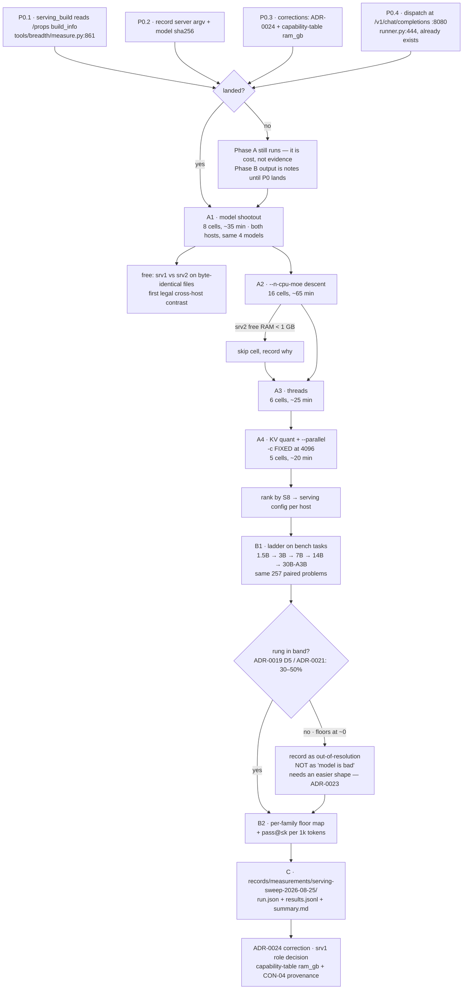
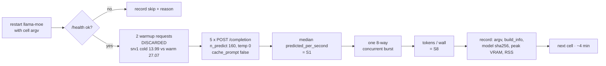

Current phase: A1

# Run plan v2 — the serving floor, and what a sweep costs

Status: **superseded on rebase, 2026-08-25.** `tools/bench/serving/` (#318) already implements
this plan's Phase A with both engines and the rigs declared in `configs/hosts.json`, and #364/#366
already ran the `--n-cpu-moe` axis more carefully. Phase B's floor question is the part still
unanswered. Kept as the design that produced
`records/measurements/serving-sweep-2026-08-25/`, whose CORRECTION section lists what it got
wrong. Originally: **draft, unapproved.** No issue number yet; per the #304 convention a plan's home is
`docs/plans/<issue>/`, so this directory is renamed once one is filed. It does not amend #302,
which was archived to `docs/archive/plans-302/` on 2026-08-25.

Evidence: `records/measurements/serving-sweep-2026-08-25/rig-reality-2026-08-25.md`. Every rig figure quoted
here is derived there and nowhere else.

**v2 supersedes v1 (same file, 2026-08-25).** v1 ranked serving configurations by
`tok/s x total params` and treated that as the answer. It is not the answer; it is the cost of
asking. Three corrections drove the rewrite, each recorded below where it bites:
the metric (§0), the context sweep (A4), and Phase B's shape (§B).

## §0 — What is being asked, and what is not

**Not the ceiling.** ADR-0017 makes the smallest worker the product rather than a stepping
stone. The ceiling belongs to the API tier and is not measured here. `tok/s x params` rewards
sparsity and low quants by construction and says nothing about whether a candidate compiles;
v1 promoted it to the ranking and was wrong to.

**The north star is value per token** (README). This plan splits it into two questions that need
different instruments and must not be run as one sweep:

| | question | metric | phase |
|---|---|---|---|
| **A** | What does a sweep cost? | **S8** — aggregate decode tok/s at 8 in flight | A1-A4 |
| **B** | Where is the floor? | **cheapest rung per family that clears the gate**, and pass@<=k per token | B1-B2 |

A is infrastructure: it decides how long B takes and nothing else. B is the product question.
A configuration that wins A and fails B's gate is recorded and not recommended.

Reference points, measured 2026-08-25 at the flags the hosts ran on arrival:

| host | model | S1 | S8 | VRAM / RSS |
|---|---|---:|---:|---|
| srv2 | qwen3-coder-30b, `--n-cpu-moe 20 -t 20 --no-mmap` | 44.96 tok/s | 92.01 at 6 in flight | 11,286 MiB / 7.66 GB |
| srv1 | qwen3-coder-30b, `--n-cpu-moe 38 -t 5` | 27.07 tok/s | not measured | 5,116 MiB / 18.87 GB |

## The run, end to end

## Preconditions

P0.1 and P0.2 gate **Phase B only**. Phase A measures the cost of running the instrument, not a
result the instrument produces, so it may run first — and does, because A's answer sets B's
budget. Nothing from B is a measurement until P0.1 and P0.2 land.

- **P0.1 — `serving_build` needs a writer for llama.cpp.** `tools/breadth/measure.py:861` probes
  `/api/version` and returns `None` on any failure; llama.cpp has no such route and publishes
  `build_info` at `GET /props`. Every Phase B cell would otherwise record `serving_build: null`,
  and `BOUND_MATCH` (`tools/bench/identity.py:283`) would compare two runs served by different
  *unknown* builds as equal — ADR-0024's failure re-entering through the null.
- **P0.2 — the server argv is identity and nothing records it.** `--n-cpu-moe`, `-t`, `-c`, `-fa`,
  `--no-mmap`, `--parallel` each move the rate; this plan varies all of them. A cell whose flags
  are not in its manifest is `--condition` again (ADR-0027 D4). Record the argv digested, plus the
  model file's sha256 — which llama.cpp does not report, so it comes from the filesystem.
- **P0.3 — three records carry the wrong RAM.** ADR-0024:35 and
  `data/capability-table.json`'s `measurement_rigs` both say 32 GB for both hosts; measured is
  **srv1 48 GB, srv2 16 GB**, and srv2 is dual-channel 2667, not single-channel 2933. Dated
  corrections, not rewrites (ADR-0036 clause 4). `capability-table.json` is what `mcgyvr init`
  reads to propose bindings, so it is the one that changes user-facing behaviour.
- **P0.4 — dispatch at `/v1/chat/completions` on :8080.** No new transport: `runner.py:444` serves
  it and `tools/bundle/measure.py:583-592` records that llama.cpp offers it. All three prior
  sweeps already recorded `"protocol": "openai"`, so CAV-01's `/api/generate` defect does not
  apply to them or to this plan.

**Done already, no longer a step.** v1 made copying `Qwen3.6-35B-A3B-UD-IQ3_XXS.gguf` to srv2 the
first action. Both hosts already hold it and `Qwen2.5-Coder-7B-Instruct-IQ4_XS.gguf` under
`/home/adaramir/ggufs`, staged 2026-08-25. srv2's container mounts the ollama blob store instead,
so the sweep mounts **both** directories.

## Phase A — what a sweep costs

**Coordinate descent, not factorial.** One factor at a time from the baseline, keeping the winner.
A full grid is ~400 cells; this is 35.

**Per cell, as a loop:**

### A1 — model shootout (8 cells, ~35 min)

Both hosts, the same four models, baseline ncmoe/threads per host. Because
`Qwen3.6-35B-A3B-UD-IQ3_XXS.gguf` and `Qwen2.5-Coder-7B-Instruct-IQ4_XS.gguf` are staged on both,
two of these eight pairs are **byte-identical-weights, identical-build cross-host contrasts** —
the first this project has had that satisfies ADR-0024's comparability rule on every axis except
host and flags. That comes free with A1; it is not a separate phase.

| model | file | GB | params | srv1 | srv2 |
|---|---|---:|---|:-:|:-:|
| qwen3-coder-30b **(baseline)** | `qwen3-coder-30b.gguf` / blob `1194192cf2a1…` | 18.56 | 30B-A3B | y | y |
| Qwen3.6-35B-A3B UD-IQ3_XXS | `Qwen3.6-35B-A3B-UD-IQ3_XXS.gguf` | 13.21 | 35B-A3B | y | y |
| gpt-oss-20b | `gpt-oss-20b.gguf` / blob `e7b273f96360…` | 13.79 | 20B-A3.6B | y | y |
| Qwen2.5-Coder-7B IQ4_XS **(dense control)** | `Qwen2.5-Coder-7B-Instruct-IQ4_XS.gguf` | 4.22 | 7B | y | y |

CAV-02 applies to the baseline: it warns that this family must be bound to an explicit GGUF under
llama-server rather than left to an ollama tag. That is what every cell here does.

### A2 — `--n-cpu-moe` descent (16 cells, ~65 min)

Top two models per host from A1.

- **srv1** (6,144 MiB VRAM, 43 GB RAM free — VRAM-bound): from 38, step down by 3 to 29.
- **srv2** (11,286 MiB of 12,288 already used at ncmoe 20, **6 GB RAM free** — near its VRAM
  ceiling): 16 / 18 / 20 / 22.

**Abort rule:** skip any cell where `free -g` on srv2 shows <1 GB available after load. srv2 runs
`--no-mmap` with 6 GB free; the OOM killer is a live risk there.

### A3 — threads (6 cells, ~25 min)

- srv1: `-t 5` (baseline) vs `-t 6` — a 6c/6t part currently leaving a core idle, and threads are
  the leading candidate for the 27-vs-45 gap.
- srv2: `-t 20` (baseline) vs `-t 16` vs `-t 10` — SMT often costs throughput on memory-bound
  expert gemm; untested here.

### A4 — KV quant and concurrency (5 cells, ~20 min)

- `-ctk q8_0 -ctv q8_0`: halves KV, buying layers back off the CPU on srv2. It changes numerics —
  anything measured under it is a different condition, not a faster same one.
- `--parallel 4` (the observed default) vs `8` vs `16`, S8 only. CON-04 measured 8.5x to 16
  concurrent on this card class under vLLM; llama.cpp's slot model gave 2.05x at 6. This cell
  measures how much of that gap is closable without leaving llama.cpp.
- **`-c` is FIXED at 4096. Do not sweep it down.** v1 proposed 2048 by confusing total context
  with the output cap. Measured over all 23,902 recorded dispatches
  (`records/measurements/**/results.jsonl`): prompt median 688, p99 1,312; prompt+completion
  median 875, p99 1,960, **max 3,107**. The worst case a 2048 output cap allows is 1,312 + 2,048 =
  3,360. 4096 carries ~25% headroom and is not where VRAM is found. This build reports n_ctx 4096
  **per slot** across 4 slots on srv2 (`GET /slots`), so the `--parallel` sweep does not shrink it.

## Phase B — where the floor is

**§B — the shape correction.** v1 gated on "pass rate within 5pp on the 80-task set". That gate is
blind at the bottom of the ladder, which is the only part this project is about. ADR-0021:

> A bench on which the floor worker scores near zero everywhere is not a hard bench — it is an
> instrument that returns the same answer for every lever, every model and every condition it will
> ever be pointed at, which is no answer.

Measured shapes, same models: MBPP+ puts the 1.5B at 56.9% and the 3B at 60.6%; d1 puts the 3B at
50.0% and the 1.5B at 35.0%; **bench shape puts the 3B at ~4%** and the 14B at 33.1%. So bench
shape resolves the 7B-and-up rungs and floors everything below. A run that reports "3B: 4%" has
measured its own resolution limit, not the model.

### B1 — ladder on bench tasks

1.5B / 3B / 7B / 14B / 30B-A3B against the same 257 paired problems, greedy, cap 2048, on each
host's Phase A winner. Every rung that lands **in band (ADR-0019 D5 / ADR-0021: 30-50%)** enters
the floor map. Every rung that floors near zero is recorded **as out-of-resolution for this
shape** — explicitly not as "the model cannot do the work" — and hands off to ADR-0023's locator
logic, which requires a rung located before a band is authored for it.

### B2 — the floor map and value per token

Two products, neither of which is a leaderboard:

1. **Cheapest rung per family that clears the acceptance gate.** Aggregate pass rate hides exactly
   this: a rung at 10% overall can be at 80% on one family and 0% on five. This is the table
   `mcgyvr init` actually needs — `data/capability-table.json`'s own `quality_metric._caveat` says
   pass@1 "ranks models; it does not predict acceptance rate on real contracts."
2. **pass@<=k per 1,000 tokens.** `results.jsonl` already records `prompt_tokens`,
   `completion_tokens` and `latency_s` per draw, and `pool-sweep-14b-cap2048` already records 90
   passing at k=0 and 115 at k<=1. Nothing has yet compared a small rung at k=4 against a large
   rung at k=1 **at equal token cost**, which is the only form in which "value per token" is a
   measurement rather than a slogan.

## Phase C — record

`records/measurements/serving-sweep-2026-08-25/` with `run.json` (per P0.1/P0.2: build from
`/props`, argv digested, model sha256), `results.jsonl` one row per cell, `summary.md` carrying
the S1/S8 table, the floor map, and the recommended argv per host.

Then: the P0.3 corrections, and a decision on ADR-0024 clause 2 — srv1 is assigned 1.5B and 3B
sweeps and is currently serving an 18.6 GB MoE.

## Budget and stop rules

- **Phase A ~2.5 h, Phase B sized by A's result.** At the arrival config a 257-task greedy pass is
  ~1 h per rung; at A's winner it may be materially less, which is the point of running A first.
- **Stop A2 early** if two consecutive ncmoe steps move S1 by <3%.
- **Record every skipped cell and why.** A sweep that silently drops OOM cells reports a ceiling it
  never tested.
- **Do not tune on B's task set and then report on it.** Phase A ranks on throughput only.
- **Restore the arrival argv when done** — both containers were started by the owner at 14:37/14:38
  UTC on 2026-08-25 and their exact argv is in the evidence file.

## What this plan does not do

- **No ceiling work.** ADR-0017: the floor is the product. The API tier is not measured here.
- **No vLLM** *(written before the rebase; `tools/bench/serving/backends/vllm.py` exists on main
  and `records/evidence/` holds ten vLLM measurement directories)*. srv2 has no local install,
  srv1's card is sm_75, and no MoE candidate fits either card in a vLLM format (Qwen3.6-35B-A3B is 24.97 GB at AWQ INT4, 37.46 GB at FP8). CON-04/05/06 in
  `data/capability-table.json` were measured under vLLM on rig_b, which today has no vLLM — that
  provenance gap is a P0.3 item, not a reason to re-run them.
- **No new model pulls.** Every file this plan touches is already staged on both hosts.
- **No change to the bench's task sets, bar, or scoring.**
